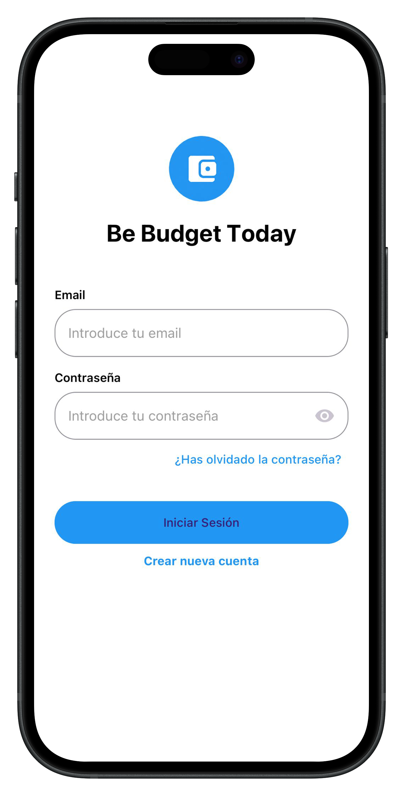
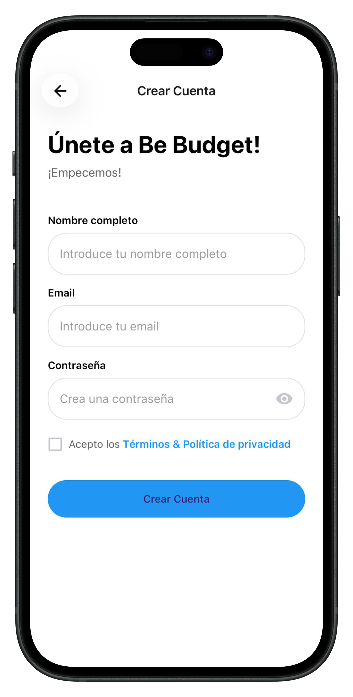
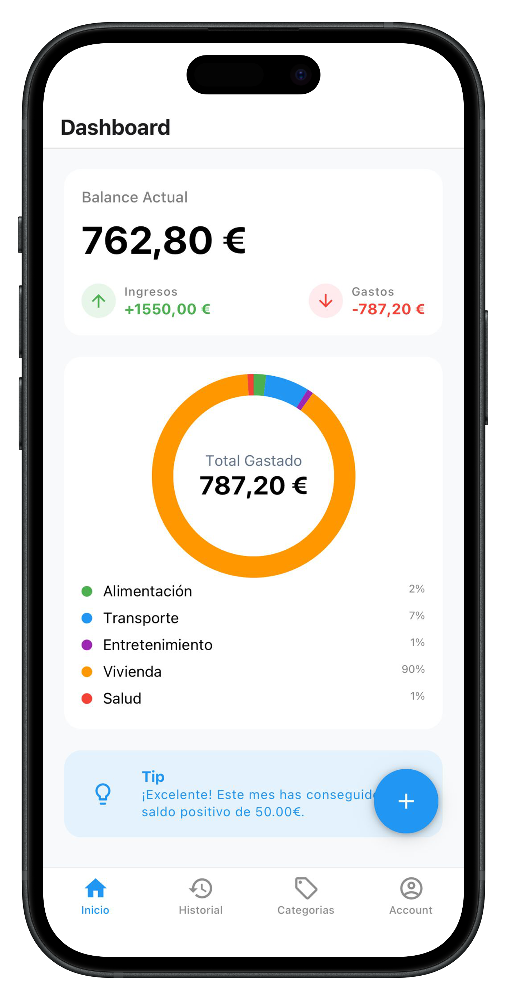
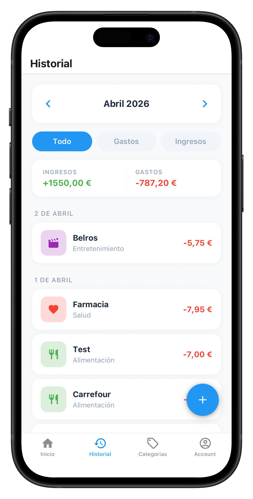
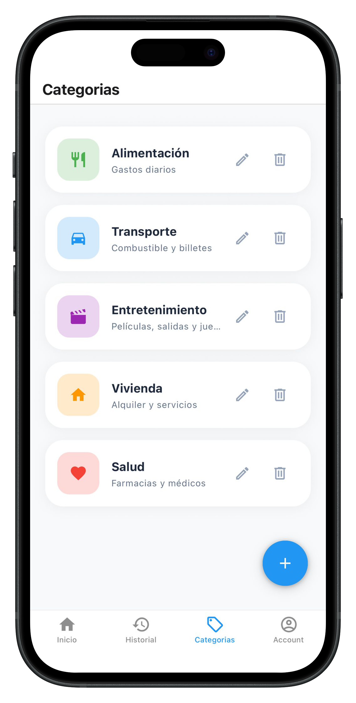
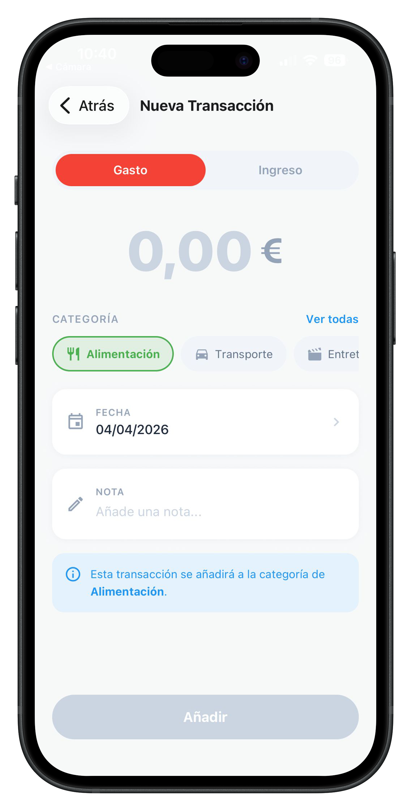
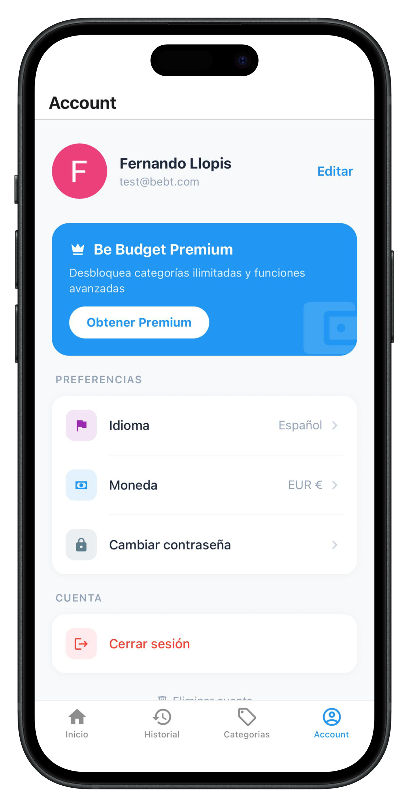
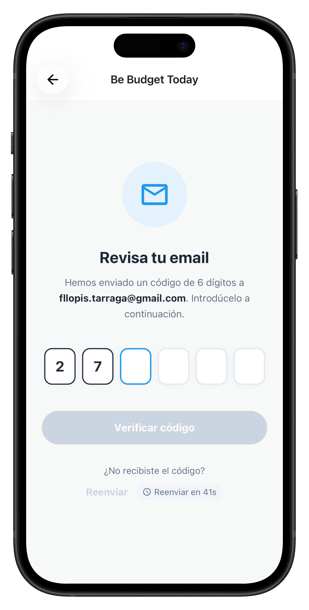

# 💰 Be Budget Today

> Personal finance app for iOS and Android — track your income, expenses and financial goals.

[](https://expo.dev)
[](https://www.typescriptlang.org)
[](https://www.php.net)
[](https://mariadb.org)
[](https://bebudgettoday.com)

---

## 📱 Screenshots

<table>
  <tr>
    <td align="center"><br/><sub>Login</sub></td>
    <td align="center"><br/><sub>Register</sub></td>
    <td align="center"><br/><sub>Dashboard</sub></td>
    <td align="center"><br/><sub>History</sub></td>
  </tr>
  <tr>
    <td align="center"><br/><sub>Categories</sub></td>
    <td align="center"><br/><sub>New Transaction</sub></td>
    <td align="center"><br/><sub>Profile</sub></td>
    <td align="center"><br/><sub>Verify Code</sub></td>
  </tr>
</table>

---

## ✨ Features

- 📊 **Dashboard** — Monthly balance, income vs expenses donut chart and savings motivation
- 📋 **Transaction history** — Grouped by day with month navigation and filters
- 🏷️ **Custom categories** — Icon, color and description per category
- 👤 **User profile** — Language, currency, password and account management
- 🔐 **Authentication** — Email/password and Google Sign-In
- 🔑 **Password recovery** — 6-digit code sent by email
- 👑 **Premium subscription** — Via Apple App Store and Google Play In-App Purchase
- 🌍 **Bilingual** — Spanish and English

---

## 🏗️ Architecture

### Frontend — React Native

```
app/
  (auth)/         → Login, Register, Forgot Password, Verify Code, Reset Password
  (tabs)/         → Dashboard, History, Categories, Profile
  category-form/  → Create and edit categories
  transaction-form/ → Create and edit transactions

src/
  components/     → Dumb components organized by feature (barrel exports)
  hooks/          → Smart hooks with business logic (Hook + Component pattern)
  context/        → AuthContext — global user session
  services/       → ApiService (axios), AuthService, StorageService
  constants/      → Currencies, Theme
  i18n/           → es.json, en.json
```

**Key decisions:**
- **Smart Hook + Dumb Component** pattern throughout — logic lives in hooks, components only render
- **Barrel exports** in every component folder for clean imports
- `initialLoading` and `refreshing` states are strictly separated to avoid layout animation issues
- `AuthContext` exposes `updateUser()` to sync profile changes across the app without re-login
- `formatAmount(amount, currencyCode, locale)` handles all currency formatting with locale-aware separators

### Backend — PHP MVC

```
Controllers/
  ApiController.php   → REST endpoints (auth, users, categories, transactions, statistics, subscriptions)
  CronsController.php → Daily cron job to expire subscriptions

Funks/
  Users.php           → Authentication, profile management, password reset
  Categories.php      → Category CRUD and default category creation
  Transactions.php    → Transaction CRUD with category join
  Dashboard.php       → Monthly summary, category stats, savings motivation
  Subscriptions.php   → IAP verification (Apple + Google), subscription lifecycle
```

---

## 🔌 API Endpoints

Full API documentation available in [`openapi.yml`](./openapi.yml) — importable directly into Postman.

| Group | Method | Endpoint | Auth |
|---|---|---|---|
| Auth | POST | `/auth/login` | — |
| Auth | POST | `/auth/register` | — |
| Auth | POST | `/auth/google` | — |
| Auth | POST | `/auth/forgot-password` | — |
| Auth | POST | `/auth/verify-code` | — |
| Auth | POST | `/auth/reset-password` | — |
| Users | GET | `/users/{id}` | JWT |
| Users | PUT | `/users/{id}` | JWT |
| Users | POST | `/users/{id}` | JWT |
| Users | DELETE | `/users/{id}` | JWT |
| Categories | GET | `/categories/` | JWT |
| Categories | POST | `/categories/` | JWT |
| Categories | PUT | `/categories/{id}` | JWT |
| Categories | DELETE | `/categories/{id}` | JWT |
| Transactions | GET | `/transactions/` | JWT |
| Transactions | POST | `/transactions/` | JWT |
| Transactions | PUT | `/transactions/{id}` | JWT |
| Transactions | DELETE | `/transactions/{id}` | JWT |
| Statistics | GET | `/statistics/monthly-summary` | JWT |
| Statistics | GET | `/statistics/categories-stats` | JWT |
| Statistics | GET | `/statistics/saving-motivation` | JWT |
| Subscriptions | GET | `/subscriptions/prices` | — |
| Subscriptions | GET | `/subscriptions/status` | JWT |
| Subscriptions | POST | `/subscriptions/verify` | JWT |

---

## 💳 Subscription System

Be Budget Today uses native **In-App Purchase** via Apple App Store and Google Play — no third-party payment processors.

| Plan | Price | Product ID |
|---|---|---|
| Monthly | €1.99/month | `com.bebudgettoday.premium.monthly` |
| Yearly | €14.99/year | `com.bebudgettoday.premium.yearly` |

**Flow:**
```
User selects plan → Store handles payment → App receives receipt/token
→ Backend verifies with Apple/Google → Subscription created in DB → User upgraded to premium
```

**Subscription lifecycle** is managed by a daily cron job that expires overdue subscriptions and downgrades users to standard automatically.

---

## 🗄️ Database Schema

```
users           → id, auth_provider, account_type, email, password, name, avatar_url, currency, language
categories      → id, id_user, type, name, description, icon, color, bg_color
transactions    → id, id_user, id_category, type, amount, description, transaction_date
subscriptions   → id, id_user, plan, status, price, currency, store, store_transaction_id, store_product_id, expires_at
password_resets → id, id_user, code, expires_at, used
configurations  → id, shortcode, value
```

All tables use **InnoDB** with `ON DELETE CASCADE` foreign keys from child tables to `users`.

---

## 🛠️ Tech Stack

| Layer | Technology |
|---|---|
| Mobile | React Native + Expo SDK 54 |
| Language | TypeScript |
| Navigation | Expo Router (file-based) |
| UI Library | React Native Paper |
| State | React Context + Custom Hooks |
| i18n | i18next |
| Charts | react-native-gifted-charts |
| Backend | PHP 8.4 MVC |
| Database | MariaDB 11.4 |
| Auth | JWT (Firebase JWT) |
| Email | PHPMailer |
| API | REST — JSON |
| Hosting | Banahosting (shared) |
| Domain | bebudgettoday.com |

---

## 🌐 Links

- 🌍 **Website:** [bebudgettoday.com](https://bebudgettoday.com)
- 📄 **Privacy Policy:** [bebudgettoday.com/en/policy-privacy](https://bebudgettoday.com/en/policy-privacy/)
- 📄 **Terms of Use:** [bebudgettoday.com/en/terms](https://bebudgettoday.com/en/terms/)
- 📄 **Refund Policy:** [bebudgettoday.com/en/refund](https://bebudgettoday.com/en/refund/)
- 📬 **Contact:** [hello@bebudgettoday.com](mailto:hello@bebudgettoday.com)

---

## 👨‍💻 Developer

**Fernando Llopis** — Full-stack developer with 12+ years of experience in PHP and MySQL, 6+ years in React Native.

- GitHub: [@fllopis](https://github.com/fllopis)
- App repo: [bebudgettoday-app](https://github.com/fllopis/bebudgettoday-app)

---

*Be Budget Today — Take control of your finances.*